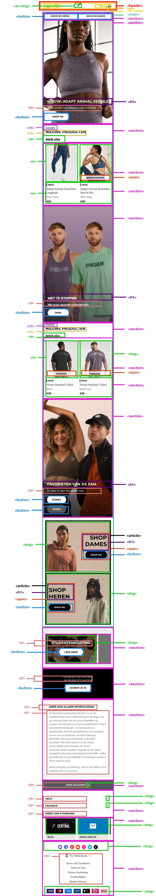

# Procesverslag
Markdown is een simpele manier om HTML te schrijven.  
Markdown cheat cheet: [Hulp bij het schrijven van Markdown](https://github.com/adam-p/markdown-here/wiki/Markdown-Cheatsheet).

Nb. De standaardstructuur en de spartaanse opmaak van de README.md zijn helemaal prima. Het gaat om de inhoud van je procesverslag. Besteedt de tijd voor pracht en praal aan je website.

Nb. Door *open* toe te voegen aan een *details* element kun je deze standaard open zetten. Fijn om dat steeds voor de relevante stuk(ken) te doen.

## Jij

  
uitwerken voor kick-off werkgroep

  ### Auteur:
  Esra Kahraman

  #### Je startniveau:
  Rood

  #### Je focus:
  Surface plane
 

## Je website

  
uitwerken voor kick-off werkgroep

  ### Je opdracht:
   https://nl.gymshark.com/?gclid=Cj0KCQiAqOucBhDrARIsAPCQL1Y9JCRSANMyCLzRI3hC4fmsfOzBDTctnIdPC0QaubLcbnmh710VYgAaAtnFEALw_wcB 

  #### Screenshot(s) van de eerste pagina (small screen): 
  Homepagina  
  

  

  

  

  

  

  

  

  #### Screenshot(s) van de tweede pagina (small screen):
  Detailpagina
  

  

  

  

  

  

  

  
 

## Breakdownschets (week 1)

  

## Toegankelijkheidstest 2/2 (week 2 & 4)

  
uitwerken na test in 1e werkgroep

  ### Bevindingen
  - Ik wil goed opletten op contrast tussen tekst en achtergrond
  - Ik wil de lettertypes bij sommige teksten iets groter zodat ze makkelijker te lezen zijn

  #### Screenreader
  Ik wil ervoor zorgen dat ik skip links ga toevoegen, zodat de gebruiker makkelijker het menu eenvoudiger kan besturen met de "tab" toets.

  #### Muis en Toetsenbord 
  Hier korte omschrijving (met indien nodig afbeeldingen)

  Hier een omschrijving van hoe het opgelost kan worden (met indien nodig afbeeldingen)

  #### Motoriek (shocks, elastiekjes)
  Ik merkte zelf dat het bedienen van de website erg moeilijk werd, maar ook het lezen werd moeilijker.

  Ik wil dit oplossen door alles makkelijker klikbaar te maken (bijv. grotere knoppen en grotere stukken tekst)

  #### Visueel (brillen, contrast, kleurenblind, dark/light). 
  Op de website van Gymshark merk ik dat ze veel grijze kleuren gebruiken bij sommige koppen. Een mooi manier om onderscheid te tonen tussen subkop en hoofdkop, maar ik merk dat dit helemaal niet toegangelijk is. Er was zo weinig verschil qua kleur tussen de achtergrond en de grijze koppen dat het bijna niet te lezen was. 

  Ik ga donkerdere kleuren gebruiken om een duidelijker verschil in contrast te creeëren.

## Voortgang 3 (week 4)

  
uitwerken voor 3e voortgang

  ### Stand van zaken
  deze week wil ik focussen op het afronden van mijn homepagina. Zowel de html als de css.

## Eindgesprek (week 5)

  
uitwerken voor eindgesprek

  ### Dit ging goed/Heb ik geleerd: 
  Ik heb de code die we in de lessen hebben geleerd kunnen toepassen. Ook dus code die ik niet eerder heb gebruikt. Het was leuk om daarmee te experimenteren en ik was zelfs trots op mezelf dat sommige dingen in een keer lukte!

  ### Dit was lastig/Is niet gelukt:
  Doordat ik in het begin niet specifiek genoeg ben geweest met mijn html benoemen in mijn css, dat sommige elementen niet kloppen. Heb tegen het einde alles moeten opschonen. Sommige elementen konden namelijk korter beschreven worden, en andere moesten weer specifieker. Zo bleef ik maar heen en weer werken...
 
  

## Bronnenlijst

  
continu bijhouden terwijl je werkt

  Nb. Wees specifiek ('css-tricks' als bron is bijv. niet specifiek genoeg).

  1. shopify.com (voor de afbeeldingen)
  2. w3schools (wel de stukken die over semantieke code gingen)

